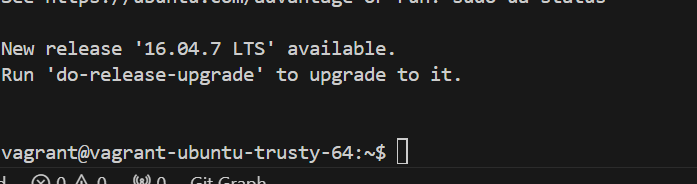
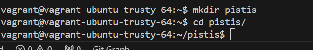
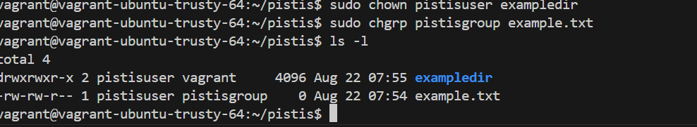
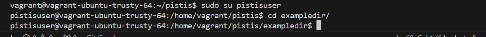

# File and Directory Permissions Project
## 1. Access the Linux System
* Inialized the vagrant using `vagrant init`
* Used the box : `ubuntu/trusty64`, started the vagrant with `vagrant up` 
2. Open a Terminal
3.  **Create and Navigate to the Directory.**
Create a new directory named `pistis` and navigate into it:
    ```
    mkdir pistis
    cd pistis
    ```


4. **Create Files and Directories.**
Create a sample file and directory to work with:
    ```
    touch example.txt
    mkdir exampledir
    ```
5. **List Files and Directories.**
List the files and directories in the current location to identify the ones you want to modify permissions for:

    `ls -l`
6. **Modify File Permissions (chmod).**
To modify file permissions, use the chmod command followed by the desired permissions and the filename. For example, to give read and write permissions to a file named "example.txt" for the owner:

    `chmod u+rw example.txt`

    `u`: Owner

    `+rw`: Add read and write permissions
7. **Modify Directory Permissions (chmod):**
To modify directory permissions, use the chmod command similarly to modifying file permissions. For example, to give read, write, and execute permissions to a directory named "exampledir" for the owner:

    `chmod u+rwx exampledir`

    `u`: Owner

    `+rwx`: Add read, write, and execute permissions
8. **Create a New Group.**
Create a new group named `pistisgroup`:

    `sudo groupadd pistisgroup`
9. **Create a New User.**
Create a new user named `pistisuser` and add them to the `pistisgroup` group:

    `sudo useradd -m -G pistisgroup pistisuser`
10. **Change File Owner (chown).**
To change the owner of a file, use the chown command followed by the new owner's username and the filename. For example, to change the owner of a file "example.txt" to the user pistisuser:

    `sudo chown pistisuser example.txt`
11. **Change Directory Owner (chown).**
To change the owner of a directory, use the chown command similarly to changing file ownership. For example, to change the owner of a directory "exampledir" to the user pistisuser:

    `sudo chown pistisuser exampledir`
12. **Change Group Ownership (chgrp).**
To change the group ownership of a file or directory, use the chgrp command followed by the group name and the filename or directory name. For example, to change the group ownership of "example.txt" to pistisgroup:

    `sudo chgrp pistisgroup example.txt`
13. **Verify Permissions and Ownership.**
Check the permissions and ownership of files and directories to ensure they have been modified as desired:

    `ls -l `   

    
14. **Test Access.**
Log in as the new owner (if applicable) and test access to the modified files and directories to ensure the changes are effective:
    ```
    sudo su pistisuser
    cd /path/to/pistis
    ```

    