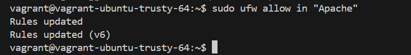
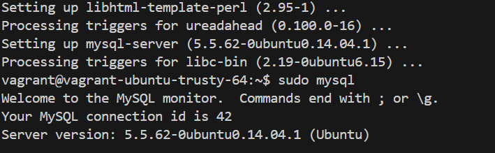
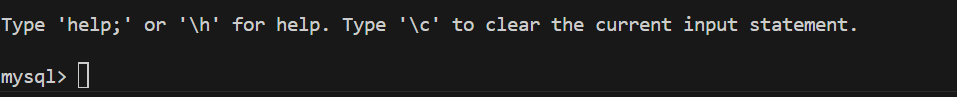
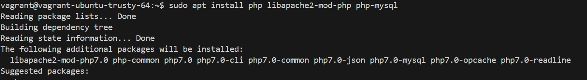
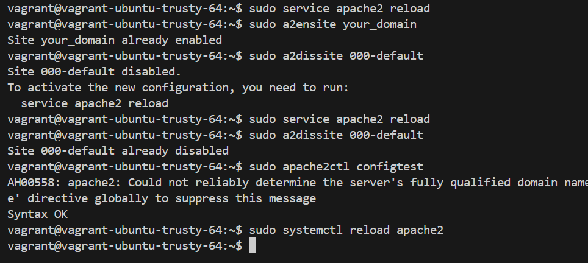

# LAMP stack : [Linux (the operating system), Apache (the web server), MySQL (the database system), and PHP (the programming language). 
### 1) Installing Apache and Updating the Firewall
* Update the package manager cache:
    `sudo apt update`
* Install Apache:
    `sudo apt install apache2`
* Allow HTTP traffic through the firewall:
    `sudo ufw allow in "Apache"`

    
### 2) **Installing MySQL.**
* Install MySQl - `sudo apt install mysql-server`

    

 * Connect to MySQL as the root user:

    `sudo mysql`

    

* **Secure MySQL installation:**
    * Connect to MySQL as the root user: `sudo mysql`
    * Change root user's authentication method to mysql_native_password (for compatibility with some PHP versions):
    ```
    ALTER USER 'root'@'localhost' IDENTIFIED WITH mysql_native_password BY 'password';
    ```
    * Exit the MySQL console: `exit`

### 3) **Installing PHP**
* Install PHP and required modules:

    `sudo apt install php libapache2-mod-php php-mysql`
    

### 4) **Creating a Virtual Host for your Website.**
* Create a new directory for your website:
        `sudo mkdir /var/www/lampstack`

* **Set ownership for the directory:** 
        `sudo chown -R $USER:$USER /var/www/lampstack`
* **Create a virtual host configuration file:**    
        `sudo nano /etc/apache2/sites-available/lampstack.conf`

* **Add the following configuration :**
    ```
        <VirtualHost *:80>
            ServerName lampstack
            ServerAlias www.lampstack
            ServerAdmin webmaster@localhost
            DocumentRoot /var/www/lampstack
            ErrorLog ${APACHE_LOG_DIR}/error.log
            CustomLog ${APACHE_LOG_DIR}/access.log combined
        </VirtualHost>
    ```
* **Enable the virtual host and disable the default one:**
    ```
        sudo a2ensite your_domain
        sudo a2dissite 000-default
        Test Apache configuration:
        sudo apache2ctl configtest
        Reload Apache:
        sudo systemctl reload apache2
    ```
        
### 5) **Testing PHP Processing on Web Server.**
* Create a test PHP file: 
    `nano /var/www/lampstack/info.php`

* Add the following PHP code:
    ```
    <?php
    phpinfo();
    ```
    Access the PHP info page in your browser `http://localhost:8080/info.php`: 
    .png)
    After confirming PHP is working, remove the info.php file:

    `sudo rm /var/www/lampstack/info.php`

    
### 6) Testing Database Connection from PHP
* **Create a test database and user:**

    * Access the MySQL console as root:
`sudo mysql -u root -p`
    * Create a database and user:
    ```
    CREATE DATABASE tolubase;
    CREATE USER 'user'@'%' IDENTIFIED BY 'password';
    GRANT ALL ON example_database.* TO 'user'@'%';
    ```
    * Exit the MySQL console: `exit`
* Create a PHP script to test database connection:

    * Create a PHP file: `nano /var/www/lampstack/todo_list.php`
    * Add the PHP script :
    ```
    <?php
    $user = "user";
    $password = "password";
    $database = "tolubase";
    $table = "todo_list";

    try {
    $db = new PDO("mysql:host=localhost;dbname=$database", $user, $password);
    echo "<h2>TODO</h2><ol>";
    foreach($db->query("SELECT content FROM $table") as $row) {
        echo "<li>" . $row['content'] . "</li>";
    }
    echo "</ol>";
    } catch (PDOException $e) {
    print "Error!: " . $e->getMessage() . "<br/>";
    die();
    }

    // Display the DevOps courses to learn
    echo "<h2>DevOps Courses to Learn</h2><ol>";
    foreach($db->query("SELECT content FROM $table") as $row) {
        echo "<li>" . htmlspecialchars($row['content']) . "</li>";
    }
    echo "</ol>";
    
    } catch (PDOException $e) {
    print "Error!: " . $e->getMessage() . "<br/>";
    die();
    }
    ?>

    <!-- HTML Form to Add a New Task -->
    <form method="POST" action="">
    <input type="text" name="new_task" placeholder="Enter a new course" required>
    <button type="submit">Add Course</button>
    </form>// Display the DevOps courses to learn
    echo "<h2>DevOps Courses to Learn</h2><ol>";
    foreach($db->query("SELECT content FROM $table") as $row) {
        echo "<li>" . htmlspecialchars($row['content']) . "</li>";
    }
    echo "</ol>";
    
    } catch (PDOException $e) {
    print "Error!: " . $e->getMessage() . "<br/>";
    die();
    }
    ?>

    <!-- HTML Form to Add a New Task -->
    <form method="POST" action="">
    <input type="text" name="new_task" placeholder="Enter a new course" required>
    <button type="submit">Add Course</button>
    </form>
    ```
Access the PHP script in browser: http://localhost:8080/todo_list.php

.png)