# LEMP stack : Linux (the operating system), Nginx (pronounced as engine-x, hence the E in the acronym), MySQL (the database system), and PHP (the programming language). 
## Prerequisites 
 Access to an Ubuntu 20.04 server as a regular, non-root sudo user.

### 1) Installing the Nginx Web Server
* Install Nginx: 
    ```
    sudo apt update
    sudo apt install nginx
    ```
    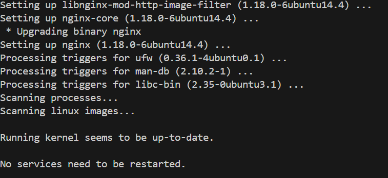

* Check which UFW profiles are available, run: `sudo ufw app list

    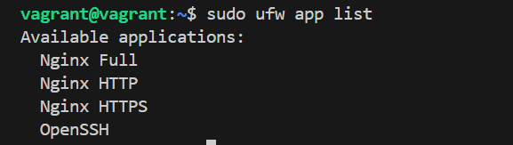

* Enable the most restrictive profile that will still allow the traffic you need. You will only need to allow regular HTTP traffic on port 80.
Enable this by typing: `sudo ufw allow 'Nginx HTTP'`

    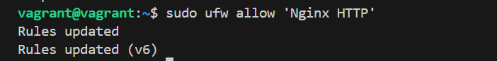
* Verify the change by running:`sudo ufw status`

    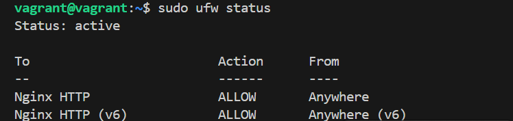
    
* Confirm Nginx’s default landing page on local host:
    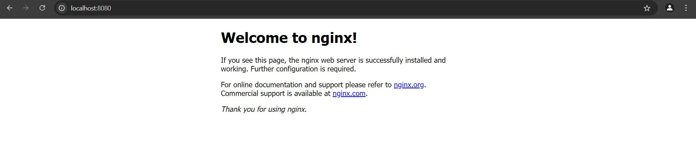

### 2) Installing MySQL
* To install this software: `sudo apt install mysql-server`
    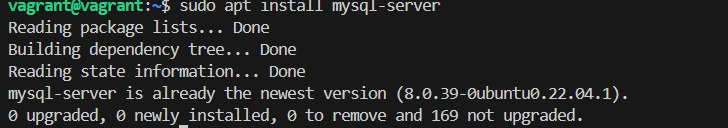

* Start the interactive script by running: `sudo mysql_secure_installation`
    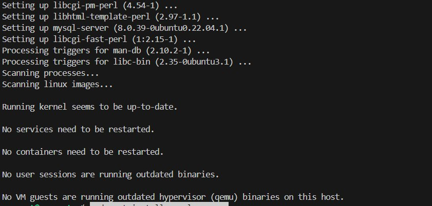

* log in to the MySQL console by typing: `sudo mysql`
    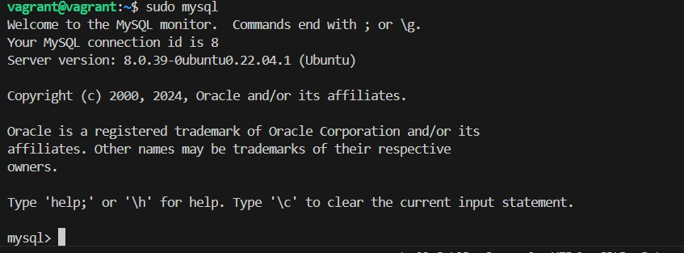

### 3) Installing PHP
* Install the php-fpm and php-mysql packages, run: `sudo apt install php-fpm php-mysql`


### 4) Configuring Nginx to Use the PHP Processor
* Create the root web directory for your_domain:`sudo mkdir /var/www/tolz`

* Next, assign ownership of the directory with the $USER environment variable, which will reference your current system user: `sudo chown -R $USER:$USER /var/www/tolz`

* Then, open a new configuration file in Nginx’s sites-available directory using nano: `sudo nano /etc/nginx/sites-available/tolz` and add: 
    ```
    server {
    listen 8080;
    server_name your_domain www.tolz;
    root /var/www/tolz;

    index index.html index.htm index.php info.php;

    location / {
        try_files $uri $uri/ =404;
    }

    location ~ \.php$ {
        include snippets/fastcgi-php.conf;
        fastcgi_pass unix:/var/run/php/php7.4-fpm.sock;
     }

    location ~ /\.ht {
        deny all;
    }
    }
    ```

* Activate your configuration by linking to the config file from Nginx’s sites-enabled directory: `sudo ln -s /etc/nginx/sites-available/tolz /etc/nginx/sites-enabled/`

* Then, unlink the default configuration file from the /sites-enabled/ directory: `sudo unlink /etc/nginx/sites-enabled/default`

* Test the configuration for syntax errors by typing: `sudo nginx -t`

* Reload Nginx to apply the changes: `sudo systemctl reload nginx`

* The website is now active, but the web root /var/www/tolz is still empty.  So we create an index.html file in that location so that we can test that the new server block works as expected using: `nano /var/www/your_domain/index.html` add: 

    ```
        <html>
    <head>
        <title>My Website</title>
    </head>
    <body>
        <h1>Welcome to My Website!</h1>
        <p>This is a sample HTML page served by Nginx.</p>
    </body>
    </html>
    ```

* Go to browser and access host: `http://localhost:8080/index.html"
    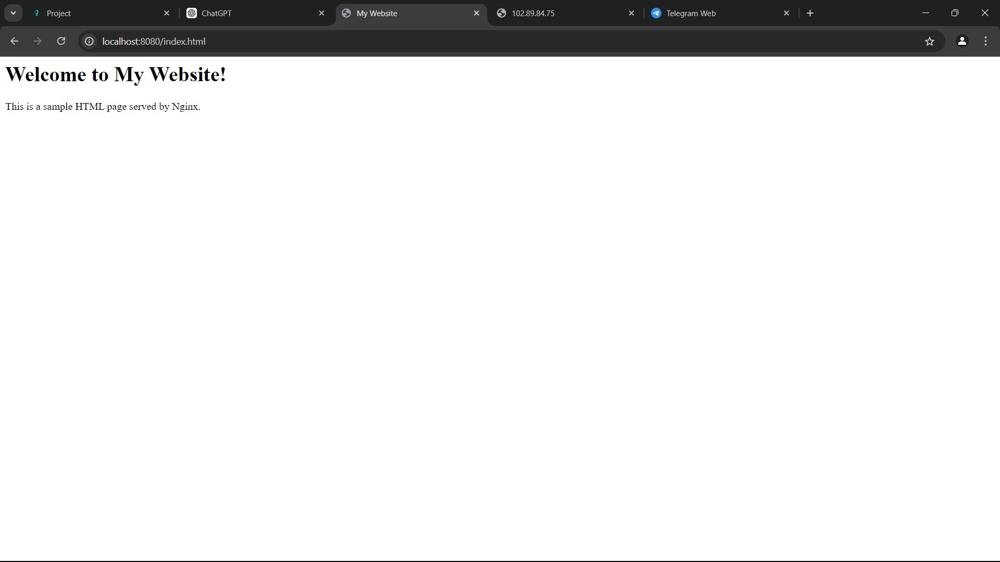

### 5) Testing PHP with Nginx
* Test it to validate that Nginx can correctly hand .php files off to your PHP processor. This can done by creating a test PHP file in your document root. Open a new file called info.php within your document root in your text editor: `nano /var/www/tolz/info.php` and add: 
    ```
        <?php
    phpinfo();
    ```
* You can access it from the browser using: `http://localhost:8080/info.php"`
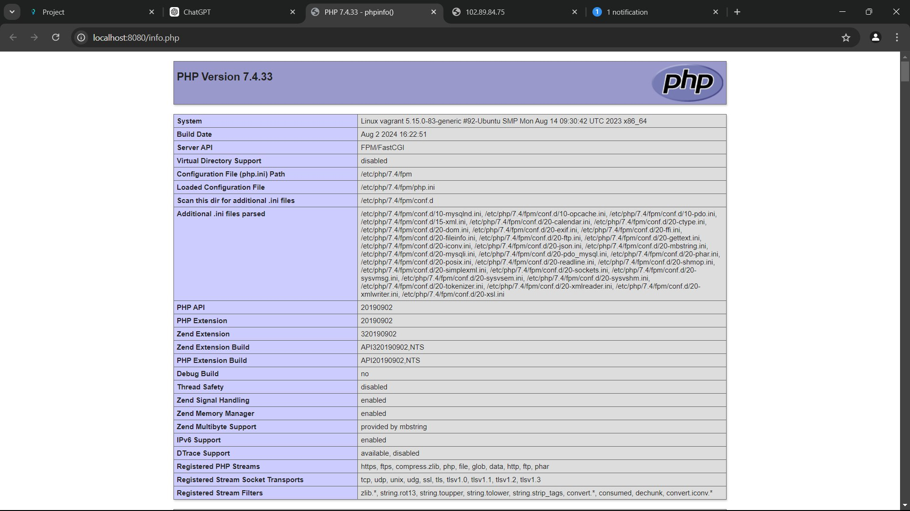

### 6) Testing Database Connection from PHP
* First, connect to the MySQL console using the root account: `sudo mysql`

* Then create a new database: `CREATE DATABASE tolubase;`

* Then create the user: `CREATE USER 'tolu'@'%' IDENTIFIED WITH mysql_native_password BY 'password';`
* Give this user permission over the database: `GRANT ALL ON tolubase.* TO 'tolu'@'%';`
    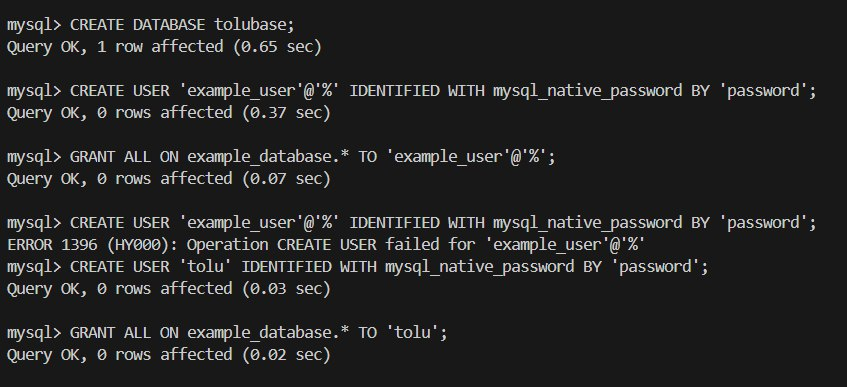

* Exit the MySQL shell: `exit`

*  Test if the new user has the proper permissions by logging in to the MySQL console again, this time using the custom user credentials: `mysql -u tolu -p`

* And type `SHOW DATABASES;`
    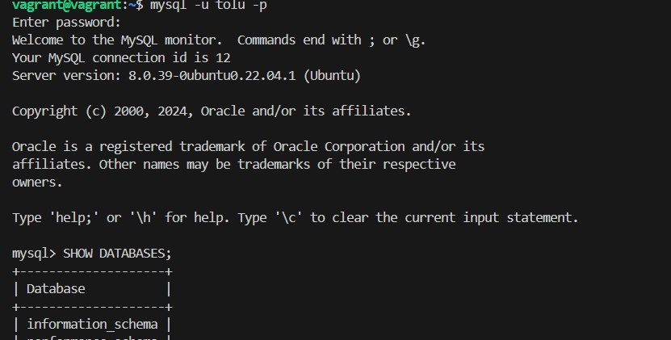

* Create a test table named todo_list. From the MySQL console:
    ```
    CREATE TABLE tolubase.todo_list (
        item_id INT AUTO_INCREMENT,
        content VARCHAR(255),
        PRIMARY KEY(item_id)
    );
    ```
* Insert a few rows of content in the test table: `INSERT INTO example_database.todo_list (content) VALUES ("My first important item");`
* To confirm that the data was successfully saved to your table, run: `SELECT * FROM tolubase.todo_list;`
* Now create a PHP script to query the database and display its data. Call this script todo.php: `nano /var/www/tolz/todo.php`. Place the following content in that file:
    ```
    <?php
    $databaseHost = 'localhost';
    $databaseName = 'example_database';
    $databaseUser = 'example_user';
    $databasePassword = 'password';

    try {
        $db = new PDO("mysql:host=$databaseHost;dbname=$databaseName", $databaseUser, $databasePassword);
        $db->setAttribute(PDO::ATTR_ERRMODE, PDO::ERRMODE_EXCEPTION);

        $query = "SELECT * FROM todo_list";
        $stmt = $db->query($query);

        echo "<h1>Todo List</h1>";

        echo "<ul>";
        while ($row = $stmt->fetch()) {
            echo "<li>" . $row['content'] . "</li>";
        }
        echo "</ul>";
    } catch (PDOException $e) {
        echo 'Connection failed: ' . $e->getMessage();
    }
    ?>
    ```

* Access this PHP script in your web browser: `http://localhost:8080/todo.php"`
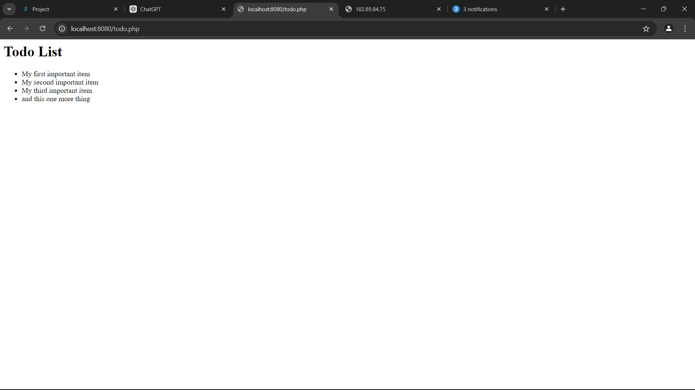


