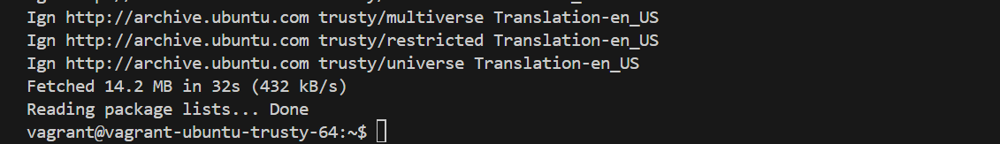
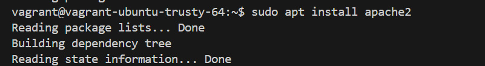
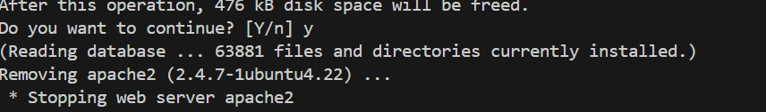
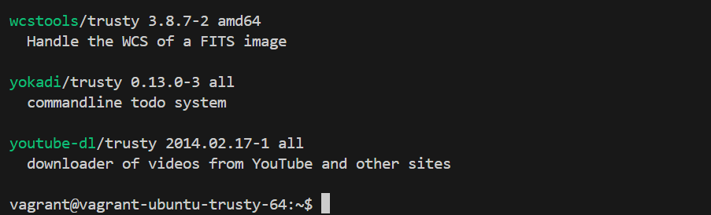
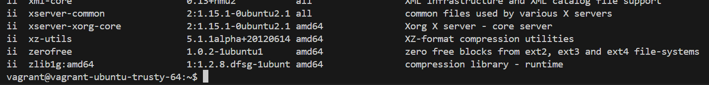
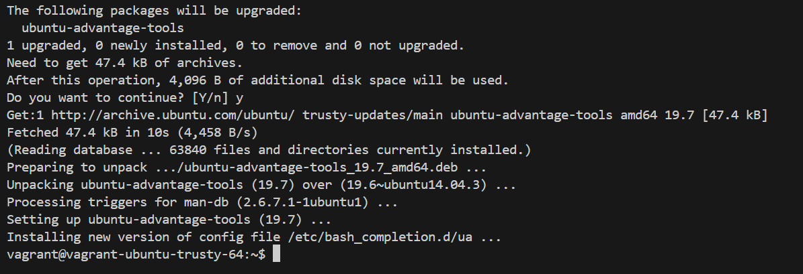

# Package Management Project
1. Access the Linux System
* Inialized the vagrant using `vagrant init`
* Used the box : `ubuntu/trusty64`, started the vagrant with `vagrant up` 
For this project, make use of a Vagrant Linux box and access it using vagrant ssh.

2. Open a Terminal

3. Update Package Repositories
Before installing or updating packages, it's essential to update the package repositories to get the latest package information. 
    ```
    sudo apt update
    ```
    
4. Install a Package
To install a new package, use the appropriate command for your package manager. 
    ```
    sudo apt install apache2
    ```

    

5. **Remove a Package.** To remove an installed package, use the appropriate command for your package manager. 
    ```
    sudo apt remove apache2
    ```

    
6. **Search for Packages.**
To search for available packages, you can use the search functionality of your package manager.
    ```
    apt search keyword
    ```
    
7. **List Installed Packages.**
You can list all installed packages on your system using the following command:
    ```
    dpkg --list
    ```

    
8. **Upgrade Installed Packages.**
To upgrade installed packages to their latest versions, use the appropriate command for your package manager:
    ```
    sudo apt upgrade
    ```
    
