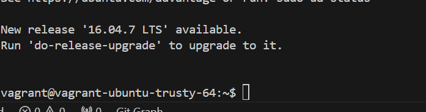
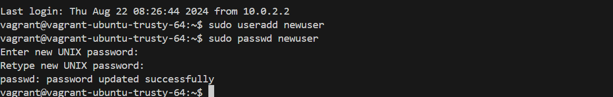
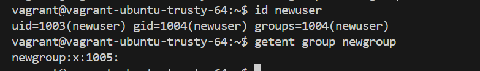

1: Access the Linux System
* Inialized the vagrant using `vagrant init`
* Used the box : `ubuntu/trusty64`, started the vagrant with `vagrant up` 
For this project, make use of a Vagrant Linux box and access it using vagrant ssh.

2. Open a Terminal
3. **Create a New User.** Create a new user using the `useradd` command. Replace newuser with the desired username.
    ```
    sudo useradd newuser
    ```
4. **Set a Password for the New User.**
Set a password for the new user using the `passwd` command:
    ```
    sudo passwd newuser
    ```
    
    

5. **Create a New Group.** Create a new group using the groupadd command. Replace newgroup with the desired group name.
    ```
    sudo groupadd newgroup
    ```
6. **Add User to a Group.** Add the newly created user to the group using the usermod command. Replace newuser with the username and newgroup with the group name.
    ```
    sudo usermod -aG newgroup newuser
    ```
7. **Verify User and Group Creation**
Check if the new user and group have been created successfully:
    ```
    id newuser
    getent group newgroup
    ```
    

8. **Modify User and Group Information.**
You can modify user and group information using the `usermod` and `groupmod` commands. For example, to change the user's home directory:
    ```
    sudo usermod -d /new/home/directory newuser
    ```
9. **Delete a User.**
To delete a user, use the `userdel` command. Be careful, as this will remove the user account.
    ```
    sudo userdel -r newuser
    ```
The `-r` flag removes the user's home directory and files associated with the user.
10. **Delete a Group.**
To delete a group, use the `groupdel` command. Be cautious, as this will remove the group.
    ```
    sudo groupdel newgroup
    ```
