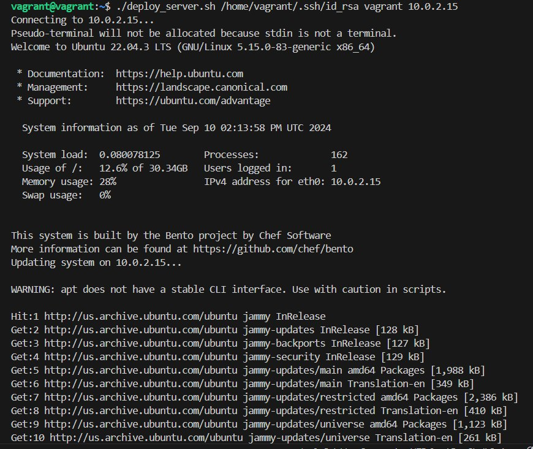

# Shell scripting: Automated Server Update and Web Server Installation Script

## Project Description:
As a system administrator, you have been given a task to automate the deployment process of your servers using shell script. The script will remotely access five servers, perform system updates, and install Nginx web servers. This project aims to streamline server maintenance and web server setup by utilizing automation. Using the best practices, write a shell script to automate the process.

### Solution

This is the content of the script which is the `deploy server.sh`

```
#!/bin/bash 
 
# Script to remotely update servers and install Nginx and Apache2 
 
# Check for required arguments 
if [ "$#" -lt 3 ]; then 
    echo "Usage: $0 <key_path> <username> <server1> [<server2> ...]" 
    exit 1 
fi 
 
# Variables 
KEY_PATH=$1 
USERNAME=$2 
SERVERS="${@:3}" 
 
# Commands to execute on each server 
UPDATE_COMMAND="sudo apt update && sudo apt upgrade -y" 
INSTALL_COMMAND="sudo apt install -y nginx apache2" 
 
# Function to run commands on a remote server 
run_commands() { 
    local server=$1 
    echo "Connecting to $server..." 
 
    ssh -i "$KEY_PATH" "$USERNAME@$server" <<EOF 
    echo "Updating system on $server..." 
    $UPDATE_COMMAND 
    echo "System update complete on $server. Installing Nginx and Apache2..." 
    $INSTALL_COMMAND 
    echo "Nginx and Apache2 installation complete on $server." 
EOF 
 
    if [ $? -eq 0 ]; then 
        echo "Successfully updated and installed web servers on $server." 
    else 
        echo "Error updating or installing web servers on $server." 
    fi 
} 
 
# Loop through all provided servers and run the commands 
for SERVER in $SERVERS; do 
    run_commands "$SERVER" 
done 
 
echo "Deployment process completed."
```

### How to use the Script
#### 1) Verify Key Path:

Ensure that the key path is correct and that the key file exists: `ls -l /home/vagrant/.ssh/id_rsa`
#### 2) Check Server Connectivity:
Verify that you can manually SSH into the server using the provided key: `ssh -i /home/vagrant/.ssh/id_rsa vagrant@10.0.2.15`
#### 3) Run the Script:

Ensure you use the correct command: `./deploy_server.sh /home/vagrant/.ssh/id_rsa vagrant 10.0.2.15`

Here's the result in my vm (I tested with one vm but it can run on multiple vms) :
